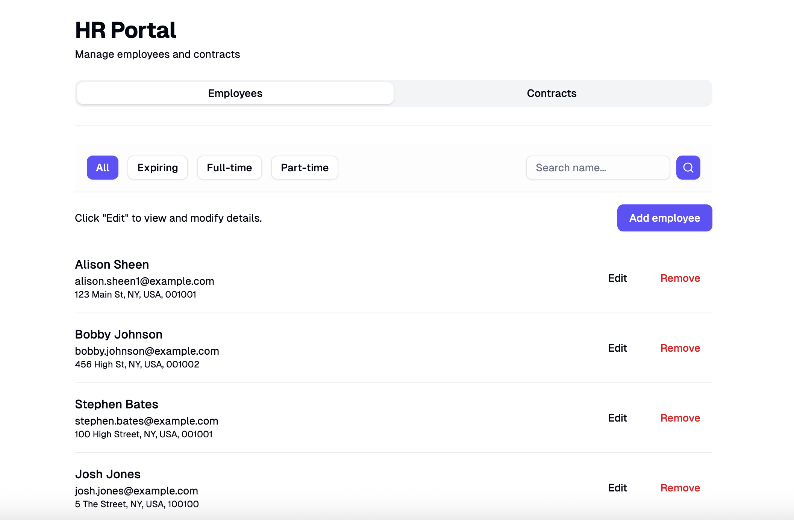

# HR Portal - Frontend

A human resources management system built with React and TypeScript. This is the frontend application which provides an interface to the backend api built with the Scala Play Framework. HR Portal allows for managing employees and contracts within an organisation.
For full details on the project, including backend setup and API documentation, please see the [backend repository](https://github.com/sidendev/hr-portal).


*HR Portal interface with employee management with filtering*

## Overview

The HR Portal frontend is a single-page application (SPA) that offers employee and contract management capabilities. The application features a clean, simple interface with filtering, pagination, and form validation.

### Key Features

- **Employee Management**: Add, edit, and delete employee records with employee profile information
- **Contract Administration**: Manage employment contracts and edit contract details
- **Employee Filtering**: Filter employees by contract type, expiring contracts and name search
- **Pagination**: Efficient data handling with paginated employee list
- **Responsive Design**: Responsive interface optimised for desktop and mobile devices
- **Form Validation**: Validation using Zod schemas
- **Real-time Feedback**: Toast notifications for user actions and system responses

## Technology Stack

### Core Framework
- **React 19.1.1** 
- **TypeScript 5.8.3** 
- **Vite 7.1.2** 

### UI Framework & Styling
- **Tailwind CSS 4.1.12** - CSS framework for UI development
- **Radix UI** - UI primitives for accessibility and customisation
- **Shadcn/ui** - Re-usable component library built on Radix UI and Tailwind CSS
- **Lucide React** - Icon set

### State Management & Data Fetching
- **TanStack React Query 5.85.3**
- **Axios 1.11.0**

### Form Management
- **React Hook Form 7.62.0**
- **Zod 4.0.17** 

## Project Structure

```
src/
├── components/          # React components
│   ├── ui/              # Reusable UI components (buttons, forms, etc.)
│   ├── ContractsPanel.tsx
│   ├── EmployeesList.tsx
│   ├── FilterBar.tsx
│   ├── Pagination.tsx
│   └── ...
├── lib/                # Utility libraries
│   ├── api.ts          # API configuration and endpoints
│   ├── utils.ts        # Helper functions
│   ├── query.ts        # React Query config
│   └── errors.ts       # Error handling utilities
├── assets/             # Static assets - to be added later
├── types.ts            # TypeScript type definitions
├── schemas.ts          # Zod validation schemas
├── App.tsx             # Main application component
├── main.tsx            # Application entry point
└── index.css           # Global styles and Tailwind imports
```

## Getting Started

### Prerequisites

- **Node.js** (version 18 or higher)
- **npm** or **yarn** package manager

### Installation

1. **Clone the repository**
   ```bash
   git clone https://github.com/sidendev/hr-portal-fe.git
   cd hr-portal-fe
   ```

2. **Install dependencies**
   ```bash
   npm install
   ```

3. **Environment Configuration**
   
   Create a `.env` file in the root directory and configure the following variables:
   ```env
   VITE_API_URL=http://localhost:9000/api
   ```
   
   Replace the API URL with your backend server endpoint if different from 9000.

4. **Start the development server**
   ```bash
   npm run dev
   ```
   
   The application will be available at `http://localhost:5173`
   Replace the port number if different, this will be shown in the terminal after running the command.
   Make sure your backend server is running and accessible so the frontend can communicate with it.

### Available Scripts

- `npm run dev` - Start the development server
- `npm run build` - Create a production build
- `npm run preview` - Preview the production build locally
- `npm run lint` - Run ESLint to check for code quality issues

### Building for Production

To create a production build:

```bash
npm run build
```

The build files will be generated in the `dist/` directory and can be deployed to any static hosting service.

## API Integration

The frontend communicates with a Scala Play Framework backend via RESTful APIs. The application supports:

- Employee CRUD operations with filtering and pagination
- Contract management with form validation
- Automatic unique email generation for new employees and on name edits
- Data validation and error handling

## Backend Repository

This frontend application requires the corresponding backend API to function properly. The backend is built with Scala Play Framework and provides RESTful endpoints for data management.

For complete project details, backend setup instructions, and API documentation, please visit the backend repository:

**[HR Portal Backend Repository]([<backend-repository-url>](https://github.com/sidendev/hr-portal))**

